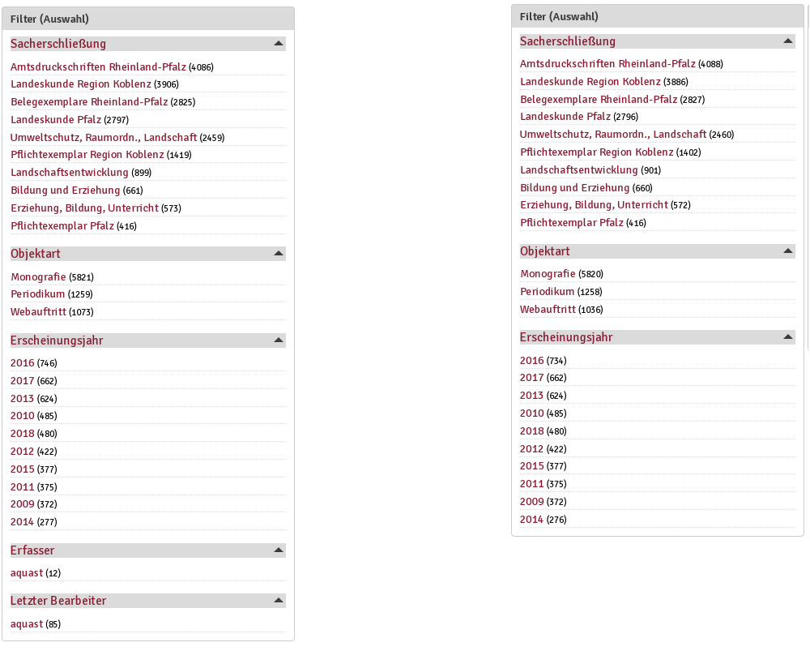

# Allgemeine Benutzung der Weboberfläche

Die Nutzeroberfläche wird ebenso wie die Authentifizierung und Kontrolle der oben genannten Rollen und Rechte über das Content-Management-System "Drupal" bereitgestellt. Die Grundfunktionen sind deshalb für alle Nutzerinnen der verschiedenen Rollen gleich. Durch die Authentifizierung als Nutzerin mit einer speziellen Rolle können weitere Nutzungen möglich gemacht werden und zugleich passt sich die Darstellung verschiedener Struktureinheiten der Weboberfläche an die Rolle an.

*Die angezeigten Filter (Facetten) unterscheiden sich je nach Nutzerrolle. links `Backend_Bearbeiter`, rechts `Gastnutzer`*
