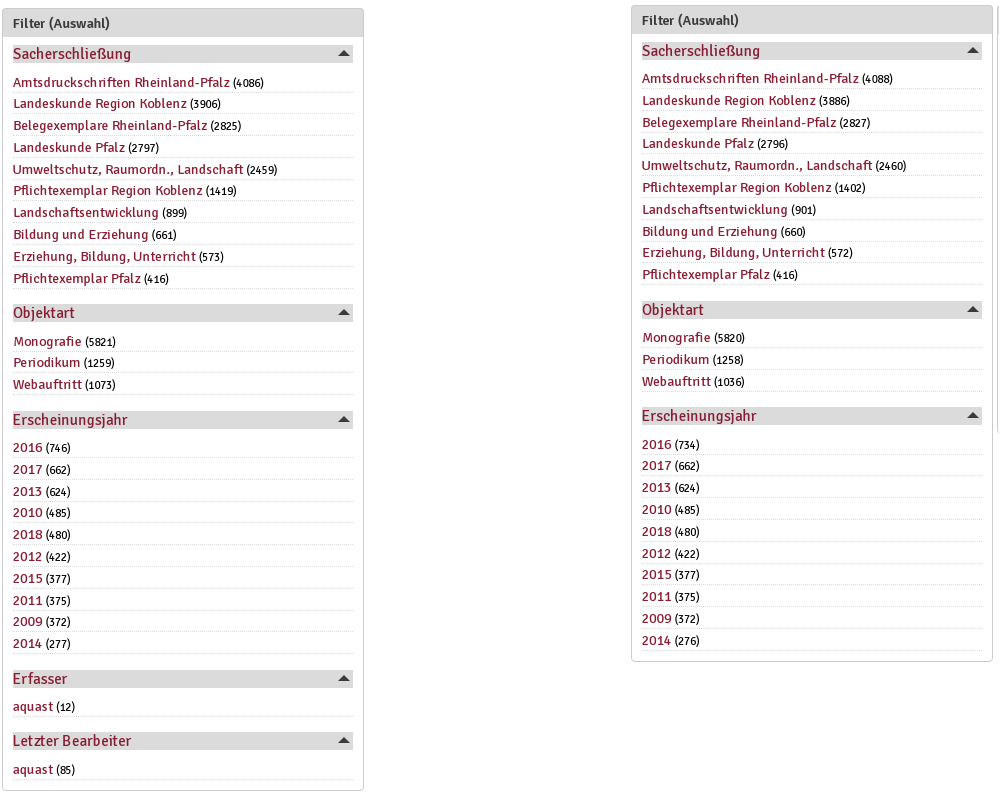
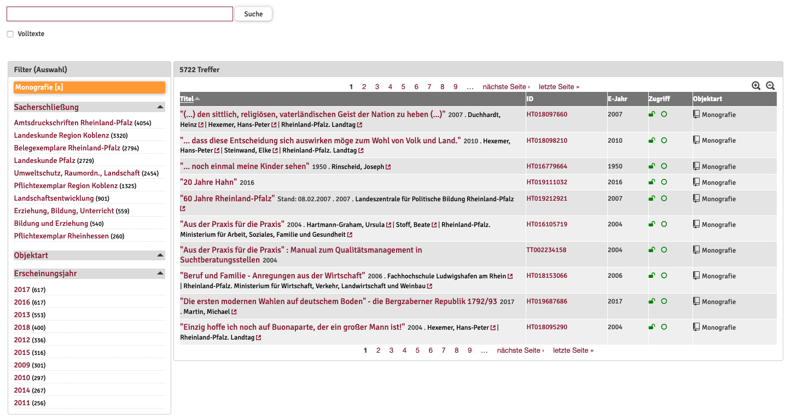

# Allgemeine Benutzung der Weboberfläche

Die Nutzeroberfläche wird ebenso wie die Authentifizierung und Kontrolle der
oben genannten Rollen und Rechte über das Content-Management-System "Drupal"
bereitgestellt. Die Grundfunktionen sind deshalb für alle Nutzerinnen der
verschiedenen Rollen gleich. Durch die Authentifizierung als Nutzerin mit einer
speziellen Rolle können weitere Nutzungen möglich gemacht werden und zugleich
passt sich die Darstellung verschiedener Struktureinheiten der Weboberfläche an
die Rolle an.

**Abb. 1:** Die angezeigten Filter (Facetten) unterscheiden sich je nach Nutzerrolle. links `Backend_Bearbeiter`, rechts `Gastnutzer`

## Suche über die Oberfläche

Für die Suche in Edoweb steht ein einfacher Suchschlitz zur Verfügung.
Dieser findet sich auf der Einstiegsseite von Edoweb und auf der Bestandsseite.
Auf beiden Seiten funktioniert die Suche identisch. Der zusätzliche Browsen-Button
auf der Einstiegsseite soll Nutzer direkt auf die Bestandsseite führen. Die Suche
arbeitet vergleichbar mit der Google-Suche. Deshalb werden alle Metadatenfelder
durchsucht und die Treffer nach einem von der Suchmaschine verwendeten Relevanz-Ranking
angezeigt.

 * Groß- und Kleinschreibung werden bei der Suche nicht beachtet 

 * Eine Trunkierung am Wortanfang oder am Wortende wird durch Anfügen eines
   Sternchens am Wortanfang oder Wortende erreicht. Beispiel: koblenz* findet
   Koblenz und koblenzer

 * Die Suche nach URLs ist aktuell leider nur mit der Phrasensuche möglich.

| Operatoren für die Suche        | Zeichen            | Beispiel                              | Ergebnis                                      |
| --------------------------------| -------------------| --------------------------------------|-----------------------------------------------|
| ODER-Verknüpfung                | OR                 | Wolfgang OR Heinrich	                | Treffer, die Wolfgang oder Heinrich enthalten |
| Phrasensuche                    | ""              | "http://www.hochwasser-rlp.de"        |Treffer der die URL "http://www.hochwasser-rlp.de" enthält|
| Trunkierung (links oder rechts) | \*                | Öffentlich\*oblenz koblenz\*       |Coblenz und Koblenz Koblenz und koblenzer|
| UND-Verknüpfung                 | standardmäßig aktiv| Wolfgang Heinrich                     |nur Treffer, die Wolfgang **und** Heinrich enthalten|

 

## Trefferanzeige und Filter

Die Treffer werden in einer Tabelle - der Trefferliste - auf der Bestandsseite
angezeigt. Jeweils 10 Treffer werden zugleich angezeigt, weitere Treffer sind
durch Blättern in der Trefferliste anzeigbar. Die gesamte Trefferliste kann durch
Mausklick auf die Spaltenköpfe sortiert werden. Sortierbare Felder sind:
ID, Erscheinungsjahr, Objektart. Durch nochmaligen Mausklick auf den Spaltenkopf
kann jeweils die Sortierrichtung geändert werden.

**Abb. 2:** Die Bestandsseite. Die Filter auf der linken Seite ermöglichen das weitere Eingrenzen

